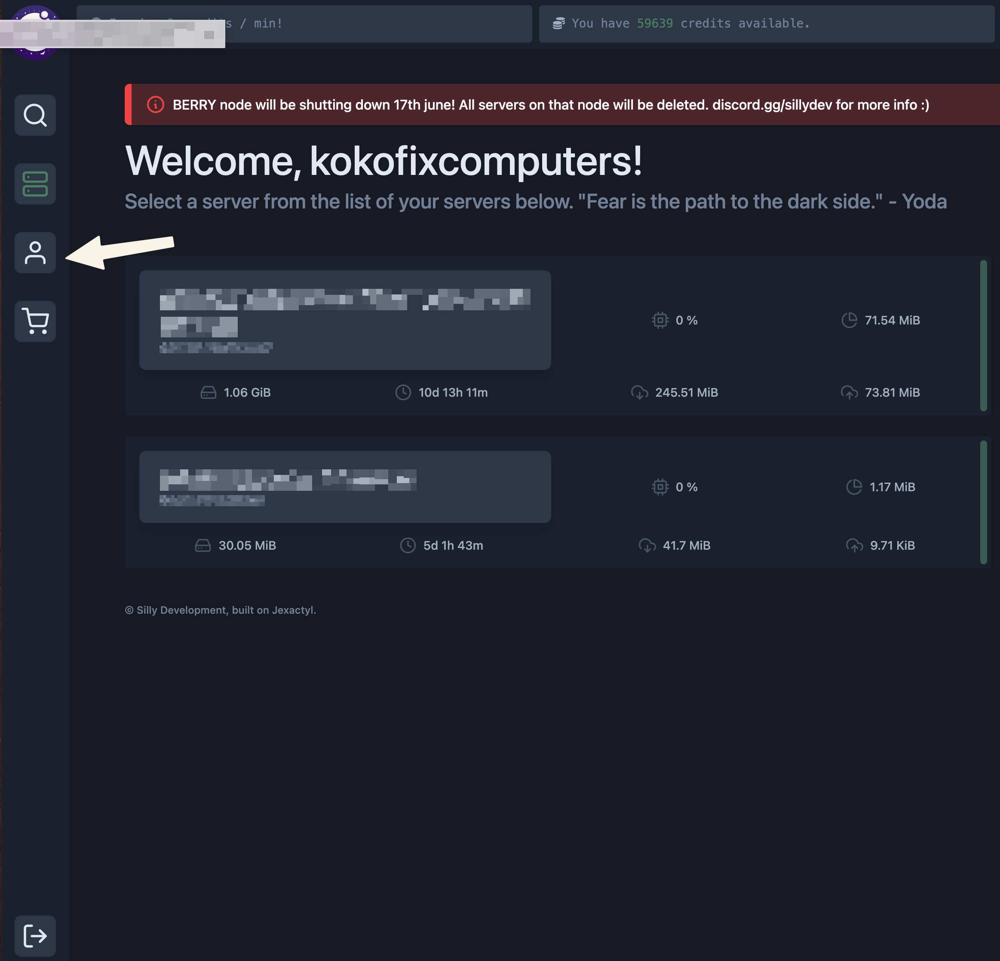

# How to get api key

Everything here requires an api key. So heres how to get one. It really depends on the theme your hosting service is using. but using the original one follow below:

1. Go to account page

<figure><figcaption></figcaption></figure>

2. Then go to api

<figure><figcaption></figcaption></figure>

3. after that, fill in the details (leave ip address blank to allow all) and click create

<figure><figcaption></figcaption></figure>
